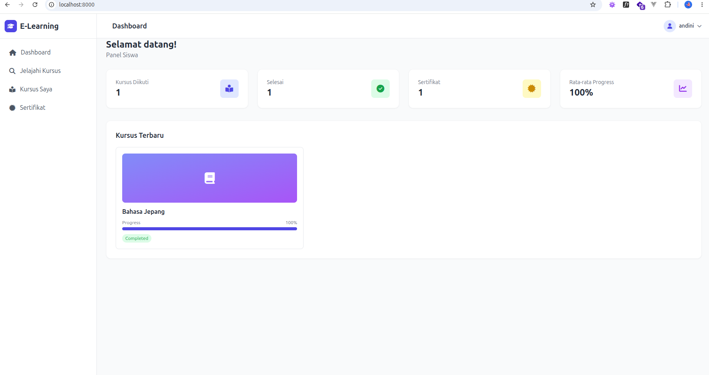
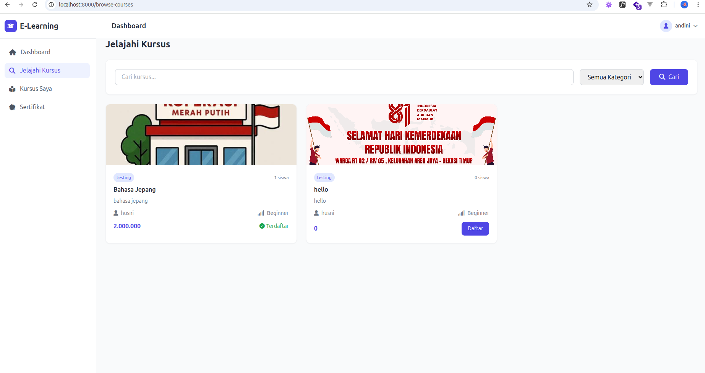
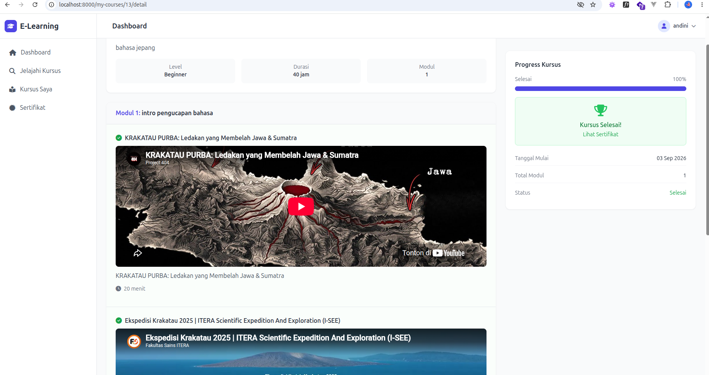
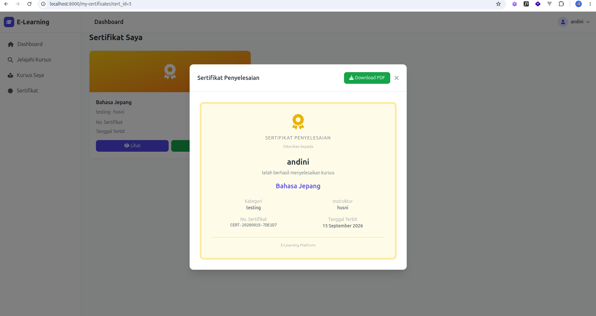

## About Elearning Application

aplikasi ini dibangun menggunakan framework laravel, framework tailwind css, dengan icon menggunakan library fontawesome dan database mysql. Di dalam aplikasi eleraning ini memiliki di role utama diantaranya admin, guru dan siswa. masing-masing role memiliki fungsi dan tugasnya sendiri.
Berikut beberapa screen shot aplikasinya:

